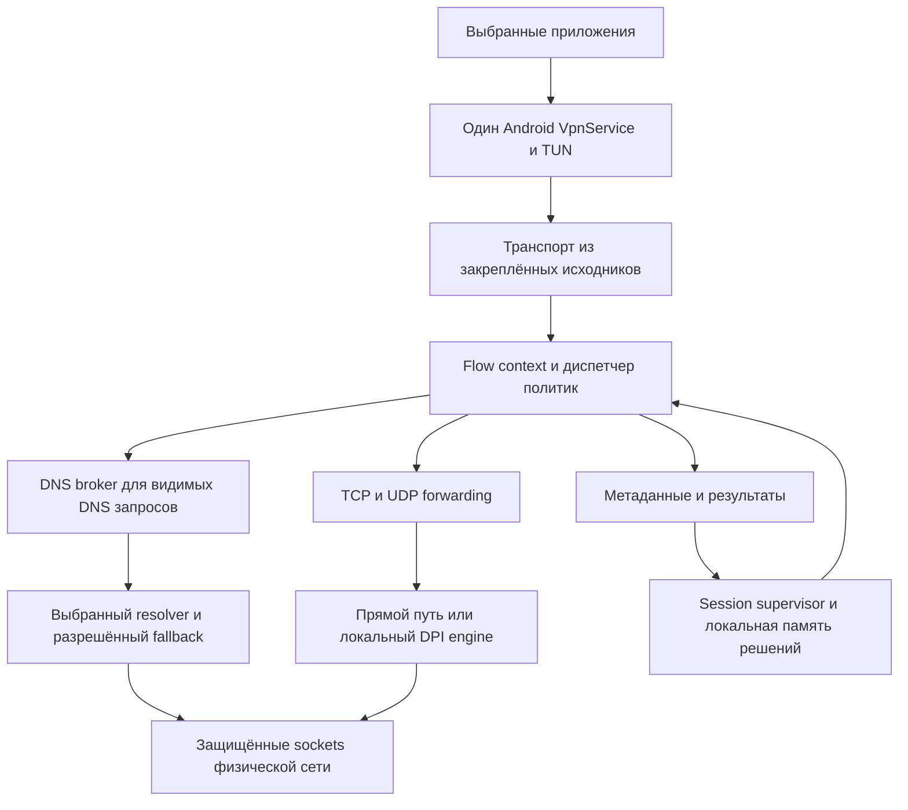

# Архитектура нового Maffinet Android

Архитектурный scope принят в P00 4 октября 2026 года. Первый transport-кандидат
и границы утверждены в [ADR-001](decisions/001-transport-prototype.md) и
[ADR-002](decisions/002-evidence-and-policy.md); окончательный stack принимается
только по реальному прототипу P01. Это целевой результат, не реализованные возможности.

Maffinet — локальный помощник доступа для выбранных приложений. Он управляет DNS и соединениями, применяет короткие проверяемые способы восстановления и объясняет наблюдаемый результат. Базовый режим работает без аккаунта, root, собственного внешнего сервера и ручного списка команд.

## Пользовательский сценарий

Первый запуск: короткое объяснение локального туннеля → выбор установленных приложений → действие «Включить» → системный VPN consent. Затем пользователь открывает выбранное приложение. Maffinet применяет доступные способы автоматически и сохраняет рабочий результат для данной сети.

Главный экран показывает выбранные приложения с иконками, компактное управление сеансом и краткую сводку. На первом экране нет выбора native-движка, DNS-провайдера, Hosts или 73 стратегий. Основные разделы: «Приложения», «Проверка», «Настройки». Их окончательная композиция определяется собственными макетами, а не прежними вкладками.

Карточка приложения показывает время и источник последних наблюдений. Допустимые сообщения: «Включено», «Ожидаем трафик», «Настраиваем доступ», «Наблюдаемые соединения проходят», «Есть ошибки», «Недостаточно данных». Статус «Приложение проверено» допустим только для явно выполненного сценария с указанием, кто и когда его проверил. Сеанс может работать при отсутствии доказательств доступа.

Добавление/удаление приложения во время сеанса создаёт новую ревизию настроек и выполняет контролируемое пересоздание VPN allowlist. UI объясняет короткое переподключение. Пустой список останавливает обработку приложений; он никогда не означает весь телефон. Собственный пакет всегда исключён.

Telegram сохраняется как дополнительный независимый инструмент. Его прокси не включается автоматически при выборе пакета Telegram: автоматическая настройка приложения Telegram через MTProto-ссылку — отдельный сценарий, который может требовать действия пользователя. Сохранённые настройки и способ подключения остаются доступны в расширенных инструментах.

## Сетевой путь

Control plane на Kotlin хранит настройки, управляет разрешениями, lifecycle, бюджетами и итогами. Native data plane передаёт пакеты и байты, выдаёт ограниченные metadata callbacks и принимает версионированные решения. Не вызывать JNI на каждый пакет; события агрегировать с ограничением очереди. Указатель на memory buffer не должен переживать его native-владельца.

Есть один владелец TUN, один supervisor сеанса и единый контракт protect/bind для всех внешних TCP/UDP/DNS/probe sockets. Loopback listeners доступны только локально. Смена физической сети отменяет операции старого поколения до публикации результатов.

## Выбор транспорта

Предпочтительный кандидат: upstream HEV из доступных закреплённых исходников с собственным узким JNI adapter. Обязательный прототип должен проверить Android TUN fd, stop/restart, TCP/UDP, IPv6, передачу исходных flow tuples, DNS interception, Android TV и сборку всех четырёх ABI.

P00 закрепил первый кандидат HEV2.14.4 на `4d6c334dbfb68a79d1970c2744e62d09f71df12f`.
TCP/UDP callbacks в `hev-socks5-tunnel.c` исследованы как точка копирования
original tuple до SOCKS; правильная ориентация и UID lookup ещё не проверены.
Нужны все recursive gitlinks и собственный external socket hook, а не импорт
JNI custom binary. Firestack `n2` — запасной опыт; standalone Outline repo
сообщает о прекращении сопровождения. Цена/критерии в [research.md](research.md).

Не считать нынешний `TProxyStartService(String, Int, Boolean)` контрактом стандартного HEV. Третье поле относится к унаследованной кастомизации. Новый bridge проектируется и тестируется самостоятельно. Старые бинарники остаются восстановимым baseline до доказанной замены, но не являются основой целевого выпуска.

Если HEV не даёт нужного hook без непропорционального изменения, P01 сравнивает другой source-built userspace stack, например архитектуру firestack/outline-go-tun2socks. Критерии выбора: лицензии, размер APK, память и CPU, Android support, исходные tuple, UDP/IPv6, отмена, качество сопровождения. Результат фиксируется ADR. Не писать собственный TCP/IP стек с нуля без доказанной необходимости.

## Ответственности кода

Это логические границы; отдельные Gradle-модули создаются только при пользе для сборки и тестирования.

| Область | Владелец и контракт |
|---|---|
| `product/apps` | Выбор пакетов, доступные установленные приложения, исключение собственного UID/package, неизвестные/удалённые пакеты |
| `product/session` | `SessionSupervisor`, desired/runtime state, поколения, start/stop/reconfigure и агрегированная диагностика |
| `network/tunnel` | TUN lifecycle, source-built transport, original flow tuple, forwarding и bounded native resources |
| `network/dns` | DNS broker, wire-preserving forwarding, cache, resolver transport и recovery policy |
| `network/flow` | Flow context, UID attribution с уровнем уверенности, связь metadata и исходного соединения |
| `network/policy` | `AccessPlanner`, короткий набор допустимых методов, бюджеты и выбор решения |
| `network/engines` | Прямой forwarding и ByeDPI adapters; capabilities каждой ревизии |
| `network/probe` | Независимые credential-free проверки, TLS identity, методы для TCP/UDP и тип результата |
| `data` | Версионированные настройки, пользовательские правила, ограниченная история и миграции |
| `ui` | ViewModel и immutable StateFlow; отображение и отправка событий без управления sockets |
| `integration/telegram` | Отдельный controller, состояние, данные подключения и воспроизводимая сборка Rust |

Типизированные настройки можно хранить в DataStore. Room применять для истории/связей только после определения схемы и объёма; runtime flow cache остаётся ограниченной памятью. Нельзя превращать новый UI в оболочку над прежними mutable globals `Actions.kt`.

## Состояния и данные

`SessionState`: Idle → AwaitingConsent → Starting → Running → Reconfiguring или Recovering → Stopping → Idle; Failed содержит этап и причину. Переходы выполняются сериализованным supervisor. STOP сначала отзывает desired state и поколение, затем закрывает ресурсы. Activity recreation не создаёт новый native singleton.

`FlowContext` содержит session generation, network generation, protocol, исходные local/remote tuple, address family, owner UID или Unknown, hostname evidence, timestamps и выбранную policy revision. Package name не является надёжным native flow ID. Shared UID, isolated processes, системные загрузчики и work profiles требуют явных ограничений.

`HostnameEvidence`: ObservedDns, VisibleSni, DeclaredRule, Ambiguous или Unknown. Связь DNS→IP у общего CDN не доказывает hostname конкретного flow. Outer SNI ECH не превращается в inner hostname. Известный профиль сервиса — подсказка, не единственный способ поддержать приложение.

`AccessDecision` хранит метод, область применения, family/protocol/port, endpoint, источник evidence, время, expiry, policy revision и generations. Ключ flow-политики включает UID, если он достоверно известен. Без UID использовать только документированную общую политику выбранного набора, не переносить per-app исключения догадкой.

DNS cache имеет отдельные ключи: network/policy, resolver, qname, qtype, class и достоверный owner context, когда доступен. DNS-запросы могут выполняться системным resolver от чужого UID; поэтому package attribution DNS не обещается по одному `getConnectionOwnerUid`.

`AccessEvidence` разделяет DNS result, TCP connect, TLS peer verification в отдельной пробе, body-prefix probe, наблюдаемое двустороннее forwarding, QUIC check и сценарий реального приложения. Успешный TLS probe не поднимается автоматически до статуса полноценной работы приложения.

## DNS broker и восстановление до TLS

Первый шаг — настоящий forwarding видимых DNS-запросов по UDP и TCP53 с виртуальным DNS-адресом VPN. Он сохраняет нормальные wire-ответы, ID, question, CNAME chain, TTL, EDNS и неизвестные RR. TCP использует length framing и допускает несколько сообщений. Upstream sockets защищены и привязаны к текущей физической сети.

Default P00 policy — resolver физической сети и сохранение private/split semantics.
Внешний recovery включается разрешённой policy. Перехват выполняется до SOCKS:
DNS-ответ возвращается с original virtual DNS source address/port, а не с
loopback broker address. Сопоставление transaction включает question, peer,
generation и ID. Кэш сначала выключен для wire-proof, потом добавляется bounded.

`DnsOutcome` различает Positive, NXDOMAIN, NODATA, SERVFAIL, Refused, Timeout, Truncated и Malformed. Положительный и отрицательный кэши имеют протокольные TTL и ограничения размера. Некорректный ответ или смена поколения не обновляют рабочий cache.

Восстановление включается по явной resolver policy: выбранный resolver → разрешённый альтернативный transport/resolver → ограниченная проверка кандидата. Пользовательские фильтры, split DNS и private ответы не обходятся автоматически. NXDOMAIN не является достаточным доказательством цензуры. Нет молчаливой отправки hostname сразу пяти внешним провайдерам.

DNS recovery возвращает согласованный ответ выбранного источника. Не смешивать A одного провайдера, AAAA другого и старые HTTPS/SVCB records. Любая специальная mapping policy отдельно задаёт домен, источник, endpoint semantics, срок и protocol scope. Успех TLS443 не даёт права произвольно подменять DNS для всех портов и UDP. Изменённый ответ не сохраняет чужой DNSSEC AD как собственную проверку.

Собственный DoH добавляется после wire-forwarding. Нужны bootstrap без resolver loop, проверка имени/сертификата, bounded pooling/timeouts, cache и понятный отказ. Plaintext downgrade допускается только заданной политикой. App-owned DoH/DoT/DoQ и системный Private DNS могут скрывать QNAME; UI показывает отсутствие наблюдаемости. Не отключать пользовательский Private DNS для удобства реализации.

## Автоматический выбор способа доступа

1. Сначала использовать актуальный проверенный метод для соответствующего контекста сети. Для неизвестного назначения — быстрый базовый путь, выбранный по результату испытаний P01/P05; сохранённые ручные команды не становятся скрытым обязательным default.
2. На наблюдаемом transport-сбое классифицировать факты: DNS error, TCP reset/timeout, TLS failure в пробе, UDP failure, unknown. Не объявлять любой timeout блокировкой.
3. Выбрать короткий набор допустимых действий: DNS transport recovery, подтверждённый endpoint, локальный DPI-приём, отдельно испытанная QUIC-policy.
4. Применить ограниченные deadline, concurrency и backoff; отменять старые результаты по generation. Быстрые запросы не должны ждать полного исследования другого hostname.
5. Сохранить рабочее решение с expiry и областью применения. На деградации сбросить доверие, а не закреплять неудачный IP навсегда.
6. По исчерпании бюджета оставить корректный transport-результат и показать причину. Экспертная диагностика доступна по действию пользователя.

Проектные бюджеты P00: recovery≤8s, ≤3 attempts на ключ, ≤2 active jobs,
≤64 queued keys, failed-key backoff≥60s. Они ещё не достигнуты; методы измерения
и изменение бюджетов определены в [test-plan.md](test-plan.md). Старый host25s
не служит продуктовой целью.

Порядок DPI приёмов определяется сравнением на fixtures и устройствах. Память сети не является бессрочным списком «хороших IP». Она хранит метод с контекстом resolver/network и проверкой актуальности.

Нельзя воспроизводить аккаунтные HTTP-запросы, POST, application data или 0-RTT. Для первого TCP-соединения исследуется только ограниченное ожидание/повтор безопасного handshake до ответа сервера и до application data. Если безопасность состояния не доказана, поддерживается только следующий flow с честным указанием этого ограничения. Удержание ClientHello само по себе не решает уже отправленный DNS NXDOMAIN.

## ECH QUIC и IPv6

ECH не удаляется, проверка сертификатов не отключается, пользовательский CA не устанавливается. DNS broker способен управлять видимым QNAME до TLS, но не открывает encrypted ClientHello и не исправляет любой cached/app-owned DNS. Проверки настоящего ECH и GREASE выполняются раздельно. Маршрут нельзя выбирать только по совпадению outer SNI.

QUIC получает отдельную UDP-модель и контрольные клиенты. Сначала обеспечить unchanged forwarding и измерения. Затем исследовать ограниченный Initial parser и fallback policy. TCP HTTPS-проба не подтверждает HTTP/3, отключение UDP443 не гарантирует fallback каждому приложению. Голос, игры и UDP других протоколов должны продолжать работать.

IPv6 входит в базовый контракт forwarding. Recovery storage и проверки имеют family-aware адреса. Happy Eyeballs и NAT64/DNS64 проверяются отдельно. Не подавлять AAAA глобально и не превращать успешный IPv4-тест в доказательство IPv6-only работы.

Fake-IP остаётся отдельным прототипом. Оно может сохранить связь hostname с synthetic destination, но требует собственного mapping lifecycle, совместимости с DNS cache, HTTPS/SVCB/ECH, UDP и shared CDN. До успешных проверок оно не становится default.

## Производительность и приватность

Не запускать полный скан при каждом включении. Ограничить очередь, число кандидатов и общую параллельность, ввести дедупликацию и negative backoff. Измерять холодный первый запрос, последующий запрос, startup/reconnect, throughput, CPU, RAM, wakeups и батарею на том же устройстве и сети.

Предварительные инженерные бюджеты для контролируемой лабораторной сети: тёплая policy lookup не задерживает forwarding; штатный DNS forwarding — до 3 секунд общего deadline; холодное recovery — до 8 секунд. Это гипотезы для P00/P01, а не опубликованные характеристики. P00 фиксирует исходные замеры и выбирает проверяемые SLO. Значение 25 секунд из текущего host recovery не переносится автоматически в новый продукт.

Хранить локально только необходимые metadata, ограничивать срок и размер истории. Пользователь может отключить подробную историю, удалить её и экспортировать обезличенный отчёт. Не записывать payload, токены, cookies, приватные IP/hostname или снимки аккаунтных экранов в Git/CI. Фоновые проверки — ограниченные и объяснимые; периодический polling не заменяет событийное наблюдение сети без замеров.

## Совместимость и самостоятельность

Сохранить `io.maffinet.android`, minSdk26 и текущую подпись для совместимого локального обновления, если пользователь не меняет требование. Target SDK и зависимости перепроверять на этапе выпуска. Данные пакетов, пользовательские домены, DNS, Telegram и экспертные команды мигрируются версионированно; неподдерживаемые поля сохраняются в локальном backup с отчётом.

Новый Android application layer, навигация, UI, onboarding, repositories и lifecycle создаются самостоятельно. ByeDPI и выбранный транспорт подключаются напрямую с их собственными лицензиями. Старые исправления служат описаниями контрактов и регрессий. Нельзя назвать переработку clean-room процессом только потому, что изменились имена: существующий код уже был изучен.

Продуктовые экраны и маркетинговые тексты новой реализации не ссылаются на другой продукт. Авторство независимых зависимостей остаётся в лицензиях. Требования атрибуции существующего заимствованного слоя сохраняются до документированного решения о его замене; никаких новых искусственных исключений из лицензии.

## Критерии работоспособности

Нужны два разных уровня проверки. Первый — отдельный helper APK с собственным UID проходит настоящий путь Android allowlist → TUN → engine → физическая сеть. Второй — согласованные реальные приложения выполняют сценарии загрузки ленты, API, медиа или иной функции на устройстве пользователя. Credentials и данные аккаунта остаются у пользователя.

Для каждого результата фиксируются устройство, Android, сеть, версия APK/source, mode, DNS/Private DNS, холодный/тёплый запуск, метод, время и ограничение. Отдельно проверяются невыбранное приложение, STOP при recovery, смена сети, deny/revoke permission, process death, OEM background, API26/29/36, TV focus и 16 KiB runtime. Возможности, не прошедшие приёмку, остаются limited/experimental и не окрашиваются в общий успешный статус.
